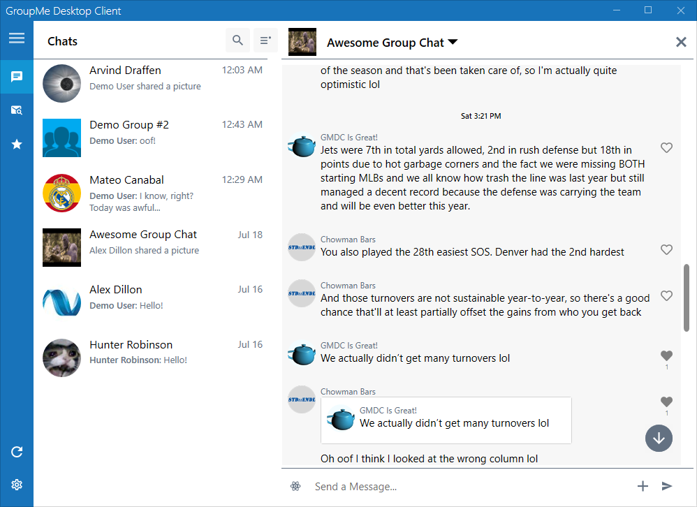
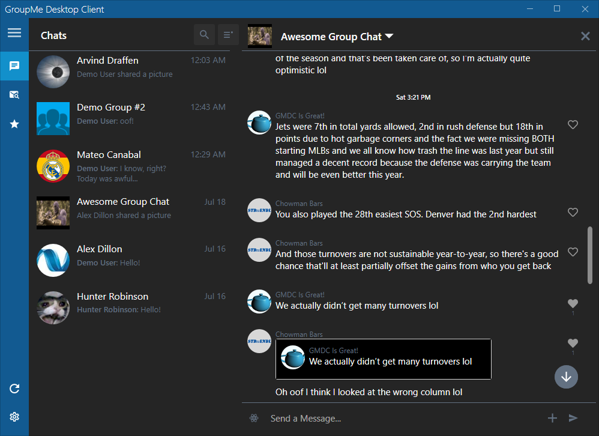
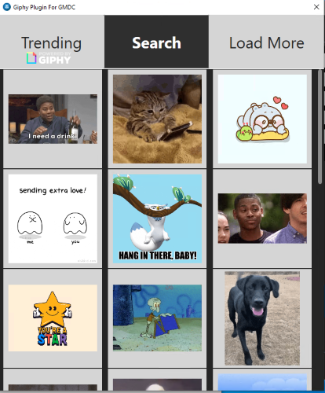
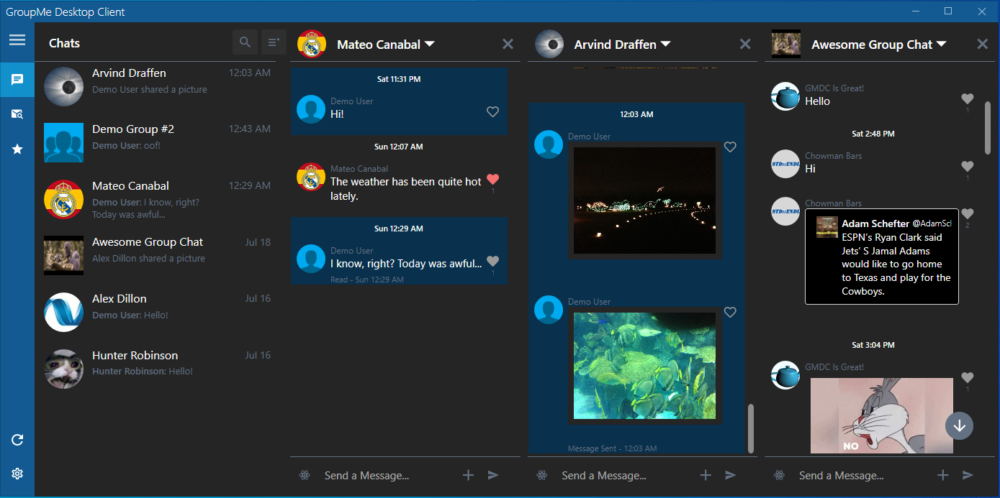

<h1 align="center">GroupMe Desktop Client</h1>

  
  
  

GroupMe Desktop Client is a unoffical, modular, open-source, configurable client for using the GroupMe chat service on Windows. GroupMe Desktop Client offers support for unique features such as search, threaded replies, and plugins, and is compatible with Windows 7 through Windows 10.

Different color theme options are also supported in GMDC.

Light Theme               |  Dark Theme
:-------------------------:|:-------------------------:
  |  

## Features
### Search
GroupMe Desktop Client offers comprehensive, offline searching functionality. Messages are automatically downloaded and indexed in the background, allowing for a variety of search filters and speedy performance.  
 
Search results can easily be viewed in-context, and attachments and images can easily be copied, saved, or shared.  

<table>
  <tr>
    <td>
    
    </td>
    <td>
    
    </td>
  </tr>
</table>

### Image Gallery
GroupMe Desktop Client includes a rich Image Gallery feature with support for filtering and search options.  
<table>
  <tr>
    <td>
    
    </td>
    <td>
    
    </td>
  </tr>
</table>

### Plugins
GroupMe Desktop Client is highly extensible through its open source plugin system. Plugins can operate in a variety of ways. For example, Message Effect Plugins can be used to help compose new messages to send, or can provide humorous suggestions based on what has been typed. More complex plugins can run in dedicated windows and can provide complex functionality.

Featured Open-Source, 3rd-Party Plugins:

<table>
  <tr>
    <td><b>
Message Effects
</b></td>
    <td><b>
Giphy Plugin
</b></td>
  </tr>
  <tr>
    <td>
    
    </td>
    <td>
    
    </td>
  </tr>
</table>

### Threaded Replies
Threaded Replies are natively supported when using GroupMe Desktop Client, and include an easy-to-read fallback option when viewing a conversation on a device that is not running GMDC. Threaded Replies allow for a message to quote an existing message or reply, and can be nested. When using GMDC, threaded replies are not images - they're fully functional copies of the original message. This allows for easy access to attachments, images, or social media posts in a conversation.

Viewing a Reply in GMDC              |  Threaded Reply in Non-GMDC
:-------------------------:|:-------------------------:
  |  

### Multi-Chat
GroupMe Desktop Client supports displaying multiple chats simultaneously, side-by-side. The number of chats that can be opened both normally, and in collapsed-sidebar mode is full user configurable. 

### Full Windows 10 Notification Support
GroupMe Desktop Client includes tight integration with Windows 10's Notification system. 

<table>
  <tr>
    <td>
    
    </td>
    <td>
    
    </td>
  </tr>
</table>

### Multi-Like
Ever wish you didn't have to click 'Like' on every single message in those busy groups? Introducing Multi-Like! Just select a range of messages, and GroupMe Desktop Client will automatically 'Like' them all for you!

### Starred Messages
GroupMe Desktop Client supports Starred Messages, allowing you to quickly access your favorite information in every Group or DM. Starred Messages are private and separate from publicly Liked messages. 

### And Much More!
 - Automatic update support
 - 1-Click Plugin installations and updates
 - Collapsible Sidebar - Great for use on laptops!
 - Support for zooming in/out on Groups and DMs
 - Support for viewing which client a message was sent from (GroupMe iOS, GroupMe Android, GroupMe Windows 10 App, GroupMe Web, GMDC, etc.)
 - Lightweight and compatible with all modern versions of Windows!

 ## Development Information
 GMDC is built using C#/WPF running on .NET Framework 4.7.2. All external dependencies are included as NuGet packages, so no special steps are required to build a copy of GMDC using Visual Studio. Visual Studio 2019 is recommended.

 [Squirrel](https://github.com/Squirrel/Squirrel.Windows) is used for automatic updating and distribution. When building in Release mode, an installer will automatically be created. Current Release builds on GitHub are automatically released through GitHub Actions. The CreateRelease workflow is activated by pushing a tag, which is used to automatically number and release the build.

 ## See Also
 [GroupMeClientApi](https://github.com/alexdillon/GroupMeClientApi) is a custom C# Library created specifically for GroupMe Desktop Client in order to interact with the GroupMe API. While it was created for use with GMDC, it is fully open-source and usable for a variety of applications!

 [GroupMePluginDemos](https://github.com/alexdillon/GroupMePluginDemos) are samples published to provide information about how to create custom GroupMe Desktop Client Plugins.

 [GroupMePlugins](https://github.com/alexdillon/GroupMePlugins) are my personal plugins that I have created and released for GroupMe Desktop Client.

[GroupMeClientAvalonia](https://github.com/alexdillon/GroupMeClientAvalonia) is an experimental port of GMDC to the Avalonia platform to provide compatibility with Windows, Linux, and macOS. GMDCA is still highly-experimental and is not suitable for daily use. The goal is to directly port over as much of GMDC to GMDCA as possible.